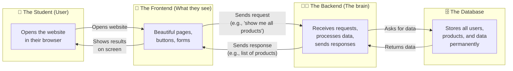
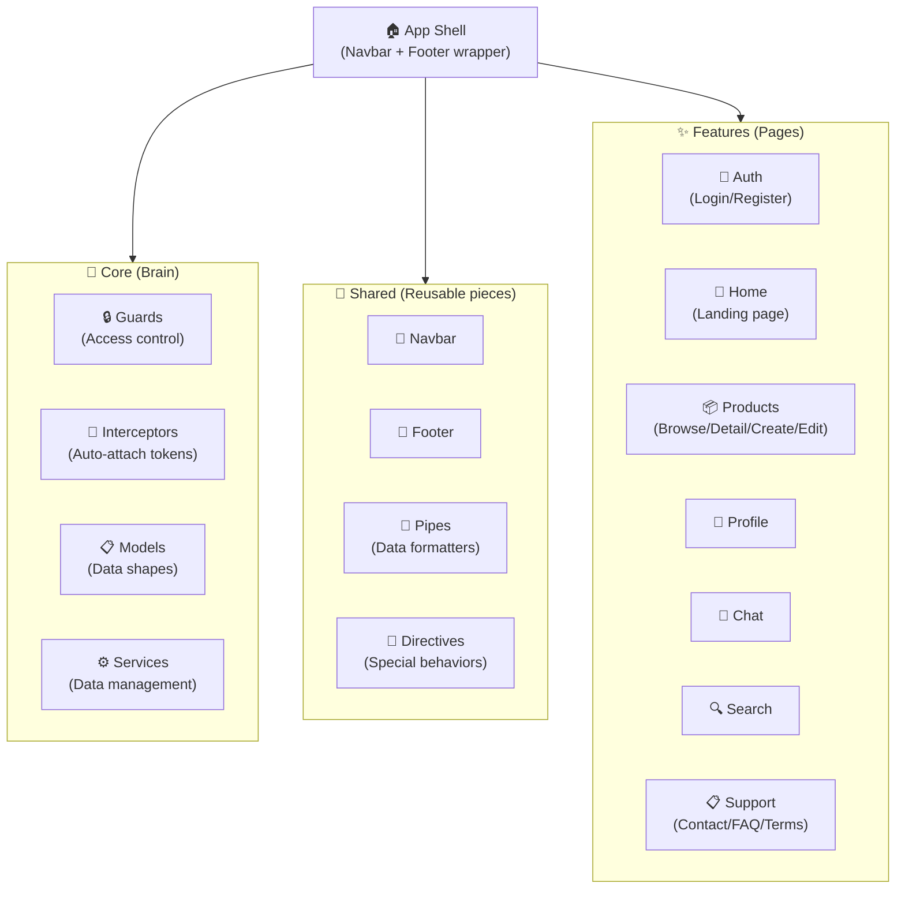
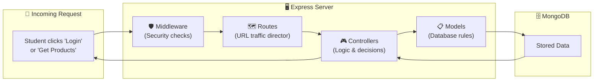
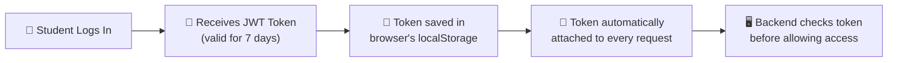

npm # 📖 Market.Arch (Nafa3ni) — Complete Project Documentation

> **Who is this for?** This document is written for someone who has **never dealt with code** before. Every technical term is explained in plain language. By the end, you'll understand exactly what this project is, how it works, and what every piece does.

---

## 📋 Table of Contents

1. [What Is This Project?](#-1-what-is-this-project)
2. [The Big Picture — How It All Works](#-2-the-big-picture--how-it-all-works)
3. [Technology Stack — What Tools Are Used](#-3-technology-stack--what-tools-are-used)
4. [The Frontend — What Users See](#-4-the-frontend--what-users-see)
5. [The Backend — The Engine Behind the Scenes](#-5-the-backend--the-engine-behind-the-scenes)
6. [The Database — Where Information Lives](#-6-the-database--where-information-lives)
7. [How Frontend & Backend Talk to Each Other](#-7-how-frontend--backend-talk-to-each-other)
8. [The Security System — How Users Are Protected](#-8-the-security-system--how-users-are-protected)
9. [The Design System — Why It Looks The Way It Looks](#-9-the-design-system--why-it-looks-the-way-it-looks)
10. [Every Page In The App — A Visual Tour](#-10-every-page-in-the-app--a-visual-tour)
11. [Every File In The Project — Complete Inventory](#-11-every-file-in-the-project--complete-inventory)
12. [Current Status & What's Real vs. Simulated](#-12-current-status--whats-real-vs-simulated)
13. [Glossary — Technical Terms Explained](#-13-glossary--technical-terms-explained)

---

## 🎯 1. What Is This Project?

**Nafa3ni** (نفعني — Arabic for "it benefited me") is a **student marketplace website**. Think of it like a mini version of OLX or Facebook Marketplace, but designed specifically for university students.

### What can students do on Nafa3ni?

| Action | Description |
|--------|-------------|
| 🛒 **Browse items** | Students can look through secondhand items organized by categories (Electronics, Furniture, Clothing, Books, etc.) |
| 📦 **Post items for sale** | If a student has something they no longer need, they can create a listing with photos, a price, and a description |
| 💬 **Chat with sellers** | Interested buyers can message sellers directly through the app |
| ❤️ **Save favorites** | Students can save items to a wishlist to come back to later |
| 👤 **Manage their profile** | Each student has a profile showing their listings, reviews, and wishlist |
| ✏️ **Edit or delete listings** | Sellers can update or remove their items at any time |
| 🔍 **Search & filter** | Students can search by keyword, filter by category, condition, or price range |

### Who built this?

This is a **graduation project** for the **DEPI (Digital Egypt Pioneers Initiative)** program. It's built as a full working prototype to demonstrate modern web development skills.

---

## 🏗️ 2. The Big Picture — How It All Works

Imagine a restaurant:



### In plain English:

1. **A student opens the website** in their browser (Chrome, Firefox, etc.)
2. **The Frontend** (the visual part) loads — they see beautiful pages with buttons, images, and forms
3. **When they do something** (like clicking "Login" or "Post Item"), the Frontend sends a message to the Backend
4. **The Backend** (the brain) receives that message, checks if it's valid, and talks to the Database
5. **The Database** is like a filing cabinet — it stores all user accounts, product listings, and messages permanently
6. **The Backend sends a response** back to the Frontend (like "Login successful!" or "Here are 20 products")
7. **The Frontend displays** the results beautifully on the student's screen

### The project is split into two main folders:

| Folder | What it is | Analogy |
|--------|-----------|---------|
| `Frontend/` | The visual website that students interact with | The restaurant's dining room — what customers see |
| `Backend/` | The server that processes data behind the scenes | The kitchen — where the real work happens |

---

## 🧰 3. Technology Stack — What Tools Are Used

> [!TIP]
> Think of these as the **building materials** used to construct the website. Just like a house needs bricks, cement, and paint, a website needs specific software tools.

### Frontend Technologies (What the user sees)

| Technology | Version | What it does | Real-world analogy |
|-----------|---------|-------------|-------------------|
| **Angular** | 21 | The main framework that builds the website pages | The *blueprint & construction crew* — it defines how every page is structured and how they behave |
| **TypeScript** | 5.9 | A programming language that adds safety rules to JavaScript | Like writing with spell-check ON — it catches mistakes before they become problems |
| **Tailwind CSS** | 4.3 | A styling tool that makes things look pretty | The *paint and decorations* — colors, spacing, fonts, shadows |
| **RxJS** | 7.8 | Handles data that changes over time (like chat messages arriving) | Like a *mail delivery system* — it watches for new data and delivers it to the right place |
| **HTML** | 5 | The skeleton of every page | The *walls and rooms* of a house |
| **CSS** | 3 | Styling rules that control colors, sizes, and layout | The *wallpaper, paint, and furniture arrangement* |

### Backend Technologies (The hidden engine)

| Technology | Version | What it does | Real-world analogy |
|-----------|---------|-------------|-------------------|
| **Node.js** | 18+ | Lets JavaScript run on a server (not just in a browser) | The *engine room* — powers everything behind the scenes |
| **Express** | 5 | A tool for building web servers that respond to requests | The *receptionist* — receives requests and routes them to the right handler |
| **MongoDB** | — | A database that stores data as flexible documents | A *digital filing cabinet* — stores user accounts, product listings, etc. |
| **Mongoose** | 9 | A tool that helps talk to MongoDB with organized rules | The *filing system* — defines what each document should look like |
| **JWT** | — | Creates secure "access passes" for logged-in users | Like a *hotel key card* — proves you're a registered guest |
| **bcrypt** | — | Scrambles passwords so nobody can read them | Like a *paper shredder for passwords* — turns "mypassword" into unreadable gibberish |

### Development Tools

| Tool | What it does |
|------|-------------|
| **Nodemon** | Automatically restarts the backend server when code changes (saves developer time) |
| **Concurrently** | Runs both Frontend and Backend at the same time with one command |
| **Prettier** | Automatically formats code to look clean and consistent |
| **Vitest** | Runs automated tests to check if code works correctly |

---

## 🖥️ 4. The Frontend — What Users See

The Frontend is the part of the app that students directly interact with. It's built using **Angular 21** and organized into logical sections:

### How the Frontend is organized



### Key concepts explained

| Concept | What it means | Example in Nafa3ni |
|---------|--------------|-------------------|
| **Component** | A reusable building block of a page (like a LEGO piece) | The Navbar is a component — it appears on every page |
| **Service** | A behind-the-scenes worker that manages data | The ProductService fetches and stores product data |
| **Guard** | A security checkpoint that blocks access to certain pages | The auth guard prevents non-logged-in users from accessing the chat page |
| **Route** | A URL path that leads to a specific page | `/products` shows the marketplace, `/chat` shows the messaging page |
| **Model** | A definition of what data looks like | The User model says every user must have a name, email, and password |
| **Pipe** | A data formatter that transforms how things are displayed | The currency pipe turns `150` into `$150` |
| **Directive** | A special behavior attached to an element | The image fallback directive shows a placeholder when an image fails to load |
| **Interceptor** | A middleman that modifies every outgoing request | The auth interceptor automatically adds the user's login token to every request |

---

## ⚙️ 5. The Backend — The Engine Behind the Scenes

The Backend is the invisible part that does the heavy lifting. It's built with **Node.js + Express** and follows a clean organizational pattern called **MVC (Model-View-Controller)**:



### What each Backend folder does

| Folder | Contains | Purpose | Analogy |
|--------|----------|---------|---------|
| `server.js` | 1 file | The main starting point — turns on the server, registers security rate-limiters and headers (Helmet), manages file upload size configuration, and routes HTTP traffic. | The *power switch and main reception* of the kitchen |
| `config/` | `db.js` | Database connection setup | The *phone line to the filing cabinet* |
| `routes/` | 8 files | URL path definitions — maps URLs like `/api/auth`, `/api/products`, `/api/conversations`, `/api/orders`, `/api/reviews`, `/api/reports`, etc., to controllers. | The *menu* — lists what you can order and how to get it |
| `controllers/` | 5 files | The actual business logic — processes requests, communicates with models/database, aggregates user rating stats, and sends responses. | The *chefs* — they do the cooking and prepare the dishes |
| `models/` | 9 files | Database schemas and validation rules — defines structure and query indexes for Users, Products, Categories, Conversations, Messages, Orders, Reviews, Reports, and Newsletters. | The *recipe cards* — define ingredients and structure |
| `middleware/` | 1 file | Security checkpoints that check for valid JWT headers and verify user sessions before allowing route access. | The *bouncer* — checks your ID/pass before letting you into VIP areas |
| `utils/` | `userStats.js` | Utility script to dynamically recalculate user ratings, transaction counts (sales/purchases), and review counts. | The *accountant* — keeps stats and scores updated |

---

## 🗄️ 6. The Database — Where Information Lives

The project uses **MongoDB**, which stores data as "documents" (similar to JSON files). Think of it as a spreadsheet, but more flexible.

### Table 1: Users Collection

> This is where **student accounts** and profiles are stored.

| Field | Type | Required? | Default Value | Description |
|-------|------|-----------|---------------|-------------|
| `_id` | ObjectId | ✅ Auto | — | A unique identifier created automatically by the database |
| `name` | Text | ✅ Yes | — | The student's full name |
| `email` | Text | ✅ Yes | — | Unique email address used for login |
| `password` | Text | ✅ Yes | — | Scrambled password hash (using bcrypt) |
| `role` | Text | ❌ No | `"user"` | Access control level: `"user"` or `"admin"` |
| `isVerified` | Boolean | ❌ No | `false` | Verification status badge |
| `avatar` | Text | ❌ No | `""` | URL or relative path to the profile picture |
| `bio` | Text | ❌ No | `""` | Brief user bio |
| `location` | Text | ❌ No | `""` | Home city / university campus location |
| `tags` | List of Texts | ❌ No | `[]` | List of interests/category tags |
| `rating` | Number | ❌ No | `5.0` | Aggregated average rating (1.0 to 5.0) |
| `totalSales` | Number | ❌ No | `0` | Aggregated count of successfully completed items sold |
| `totalPurchases` | Number | ❌ No | `0` | Aggregated count of successfully completed items bought |
| `resetPasswordToken`| Text | ❌ No | `null` | Secure token for password recovery |
| `resetPasswordExpires`| Date | ❌ No | `null` | Expiration time for password recovery token |
| `createdAt` | Date/Time | ✅ Auto | — | When the account was created |
| `updatedAt` | Date/Time | ✅ Auto | — | When the account was last modified |

### Table 2: Products Collection

> This is where **item listings** are stored.

| Field | Type | Required? | Default Value | Description |
|-------|------|-----------|--------------|-------------|
| `_id` | ObjectId | ✅ Auto | — | Unique identifier |
| `title` | Text | ✅ Yes | — | Name of the item (e.g., "Vintage Leather Jacket") |
| `description` | Text | ❌ No | — | Detailed description of the item |
| `price` | Number | ✅ Yes | — | Cost in the specified currency |
| `images` | List of Texts | ❌ No | `[]` | Local upload paths (`/uploads/...`) or external URLs |
| `categoryId` | ObjectId | ✅ Yes | — | Reference to Category document |
| `dynamicAttributes`| Map of Mixed | ❌ No | — | Custom category attributes (Condition, conditionScore, brand, size, etc.) |
| `location` | Text | ✅ Yes | — | Location where item is listed |
| `phoneNumber` | Text | ✅ Yes | — | Contact telephone number |
| `showContactInfo` | Boolean | ❌ No | `true` | Show/hide contact details publicly |
| `userId` | ObjectId | ✅ Yes | — | Reference to User document who posted this item |
| `soldByNafa3ni` | Boolean | ❌ No | `false` | Whether listing is curated directly by the system |
| `isVerified` | Boolean | ❌ No | `false` | Whether listing details are verified by admin |
| `status` | Text | ❌ No | `"active"` | Listing status: `"active"`, `"sold"`, or `"draft"` |
| `viewCount` | Number | ❌ No | `0` | Number of clicks/views |
| `createdAt` | Date/Time | ✅ Auto | — | When the listing was posted |
| `updatedAt` | Date/Time | ✅ Auto | — | When the listing was last edited |

### Table 3: Categories Collection

> This is where the product **category filters and dynamic specifications** are stored.

| Field | Type | Required? | Description |
|-------|------|-----------|-------------|
| `_id` | ObjectId | ✅ Auto | Unique identifier |
| `name` | Text | ✅ Yes | Unique category name (e.g., "Clothes", "Electronics") |
| `attributes` | List of Objects | ❌ No | Nested list of attributes containing: `name`, `type` (select/radio/text), `options` (dropdown array), `required` (boolean), and `hasOther` (boolean) |

### Table 4: Conversations Collection

> This is where **chat metadata** linking buyers, sellers, and listings is stored.

| Field | Type | Required? | Description |
|-------|------|-----------|-------------|
| `_id` | ObjectId | ✅ Auto | Unique identifier |
| `participants` | List of ObjectIds| ✅ Yes | References to the two users involved in the conversation |
| `productId` | ObjectId | ❌ No | Reference to the Product listing being discussed |
| `lastMessage` | ObjectId | ❌ No | Reference to the most recent Message in the chat |
| `createdAt` | Date/Time | ✅ Auto | Timestamp when chat was initialized |
| `updatedAt` | Date/Time | ✅ Auto | Timestamp of the last sent message or status change |

### Table 5: Messages Collection

> This is where **individual chat message logs** are stored.

| Field | Type | Required? | Default Value | Description |
|-------|------|-----------|---------------|-------------|
| `_id` | ObjectId | ✅ Auto | — | Unique identifier |
| `conversationId` | ObjectId | ✅ Yes | — | Reference to the Conversation parent document |
| `senderId` | ObjectId | ✅ Yes | — | Reference to the User who sent the message |
| `content` | Text | ✅ Yes | — | Plain text message payload |
| `status` | Text | ❌ No | `"sent"` | Message delivery status: `"sent"`, `"delivered"`, or `"read"` |
| `createdAt` | Date/Time | ✅ Auto | — | Timestamp of message |
| `updatedAt` | Date/Time | ✅ Auto | — | Timestamp of last message edit/status update |

### Table 6: Orders Collection

> This is where **purchase transactions** between students are stored.

| Field | Type | Required? | Default Value | Description |
|-------|------|-----------|---------------|-------------|
| `_id` | ObjectId | ✅ Auto | — | Unique identifier |
| `productId` | ObjectId | ✅ Yes | — | Reference to the Product listing purchased |
| `buyerId` | ObjectId | ✅ Yes | — | Reference to the User buying the item |
| `sellerId` | ObjectId | ✅ Yes | — | Reference to the User selling the item |
| `price` | Number | ✅ Yes | — | Transaction price agreed upon |
| `status` | Text | ❌ No | `"pending"` | Order state: `"pending"`, `"shipped"`, `"delivered"`, or `"cancelled"` |
| `paymentMethod` | Text | ✅ Yes | — | Chosen payment mechanism (e.g. cash, card, swap) |
| `shippingAddress` | Text | ✅ Yes | — | Destination address for shipping/handover |
| `notes` | Text | ❌ No | — | Optional transaction notes |
| `trackingNumber` | Text | ❌ No | — | Optional package tracking reference |
| `createdAt` | Date/Time | ✅ Auto | — | Timestamp of order |
| `updatedAt` | Date/Time | ✅ Auto | — | Timestamp of last order status change |

### Table 7: Reviews Collection

> This is where **user feedback and star ratings** for completed orders are stored.

| Field | Type | Required? | Description |
|-------|------|-----------|-------------|
| `_id` | ObjectId | ✅ Auto | Unique identifier |
| `orderId` | ObjectId | ✅ Yes | Reference to the completed Order being evaluated |
| `reviewerId` | ObjectId | ✅ Yes | Reference to the User who wrote the review |
| `revieweeId` | ObjectId | ✅ Yes | Reference to the User who received the review (the seller) |
| `productId` | ObjectId | ✅ Yes | Reference to the Product listing bought |
| `rating` | Number | ✅ Yes | Numerical score from `1` to `5` stars |
| `comment` | Text | ✅ Yes | Written commentary |
| `createdAt` | Date/Time | ✅ Auto | Timestamp of submission |

### Table 8: Reports Collection

> This is where **reported listings** submitted by users are stored for moderation.

| Field | Type | Required? | Description |
|-------|------|-----------|-------------|
| `_id` | ObjectId | ✅ Auto | Unique identifier |
| `productId` | ObjectId | ✅ Yes | Reference to the Product listing reported |
| `reporterId` | ObjectId | ✅ Yes | Reference to the User filing the report |
| `reason` | Text | ✅ Yes | Pre-categorized reason for reporting (e.g., spam, fake product) |
| `details` | Text | ❌ No | Additional notes/details explaining report |
| `createdAt` | Date/Time | ✅ Auto | Timestamp of submission |

### Table 9: Newsletter Collection

> This is where **marketing email subscriptions** are stored.

| Field | Type | Required? | Description |
|-------|------|-----------|-------------|
| `_id` | ObjectId | ✅ Auto | Unique identifier |
| `email` | Text | ✅ Yes | Unique email address subscribed to the newsletter |
| `createdAt` | Date/Time | ✅ Auto | Timestamp of subscription |


---

## 🔌 7. How Frontend & Backend Talk to Each Other

The Frontend and Backend communicate using something called a **REST API** — which is just a fancy way of saying "they send messages to each other over the internet using specific URLs."

### The conversation looks like this:

```
Frontend: "Hey Backend, I need to log in. Here's my email and password."
         → POST http://localhost:3000/api/auth/login
         → Body: { "email": "aya@gmail.com", "password": "123456" }

Backend:  "Let me check... email exists ✅, password matches ✅. 
           Here's your access token. Welcome back!"
         → Response: { "message": "Login Success", "token": "abc123...", "user": {...} }
```

### Complete List of Backend Endpoints (URLs)

> [!NOTE]
> An **endpoint** is like a specific phone number you call to get a specific service. Each endpoint has a **method** (the type of action) and a **URL** (the address).

#### 🔐 Authentication & Profile Endpoints

| Method | URL | Auth Required? | What you send | What you get back |
|--------|-----|----------------|---------------|-------------------|
| **POST** | `/api/auth/register` | ❌ No | `{ firstName, lastName, email, password }` | `{ message: "User Registered Successfully", user: {...} }` |
| **POST** | `/api/auth/login` | ❌ No | `{ email, password }` | `{ message: "Login Success", token: "...", user: {...} }` |
| **GET** | `/api/auth/user/:id` | ❌ No | Nothing (URL parameter `:id`) | `{ id, firstName, lastName, email, role, avatar, bio, location, tags, rating, totalSales, totalPurchases, isVerified }` |
| **PUT** | `/api/auth/user/:id` | ✅ Yes | `{ name, bio, location, tags, avatar, password }` | `{ message: "Profile Updated", user: {...} }` |
| **POST** | `/api/auth/forgot-password` | ❌ No | `{ email }` | `{ message: "Reset token sent" }` |
| **POST** | `/api/auth/reset-password` | ❌ No | `{ token, newPassword }` | `{ message: "Password updated successfully" }` |
| **POST** | `/api/auth/validate-reset-token`| ❌ No | `{ token }` | `{ valid: true/false }` |

**Validation rules for registration:**
- All fields (name, email, password) must be filled in
- Email must be in a valid format (e.g., `someone@example.com`)
- Password must be at least 6 characters long
- Email must not already be used by another account

#### 📦 Product & Category Endpoints

| Method | URL | Auth Required? | What you send | What you get back |
|--------|-----|----------------|---------------|-------------------|
| **GET** | `/api/products` | ❌ No | Optional filters: categories (`categoryId`), condition, price | List of products matching filters (newest first) |
| **GET** | `/api/products/:id` | ❌ No | Nothing (URL parameter `:id`) | Detailed product listing object |
| **POST** | `/api/products` | ✅ Yes | `{ title, description, price, categoryId, location, phoneNumber, images, showContactInfo, dynamicAttributes }` | `{ message: "Product Created Successfully", product: {...} }` |
| **PUT** | `/api/products/:id` | ✅ Yes | `{ title, description, price, images, dynamicAttributes }` | `{ message: "Product Updated Successfully", product: {...} }` |
| **DELETE**| `/api/products/:id` | ✅ Yes | Nothing (URL parameter `:id`) | `{ message: "Product Deleted Successfully" }` |
| **GET** | `/api/products/user/:userId`| ❌ No | Nothing (URL parameter `:userId`) | List of products listed by a specific seller |
| **GET** | `/api/products/counts/by-category`| ❌ No | Nothing | Counts of items listed per category |
| **GET** | `/api/categories` | ❌ No | Nothing | Array of available Category documents and attributes |

#### 💬 Chat & Conversation Endpoints

| Method | URL | Auth Required? | What you send | What you get back |
|--------|-----|----------------|---------------|-------------------|
| **GET** | `/api/conversations` | ✅ Yes | Nothing | List of conversations active for the logged-in user |
| **POST** | `/api/conversations` | ✅ Yes | `{ participantId, productId }` | `{ conversationId: "..." }` — Starts or retrieves chat |
| **GET** | `/api/conversations/:conversationId/messages`| ✅ Yes | Nothing (URL parameter `:conversationId`) | Messages within a specific conversation |
| **POST** | `/api/conversations/messages`| ✅ Yes | `{ conversationId, content }` | Created Message document |
| **PUT** | `/api/conversations/:conversationId/read`| ✅ Yes | Nothing (URL parameter `:conversationId`) | `{ success: true }` — Marks messages in chat as read |

#### 🛒 Order & Transaction Endpoints

| Method | URL | Auth Required? | What you send | What you get back |
|--------|-----|----------------|---------------|-------------------|
| **POST** | `/api/orders` | ✅ Yes | `{ productId, price, paymentMethod, shippingAddress, notes }` | `{ message: "Order placed successfully", order: {...} }` |
| **GET** | `/api/orders` | ✅ Yes | Nothing | List of purchases and sales involving the logged-in user |
| **GET** | `/api/orders/:id` | ✅ Yes | Nothing (URL parameter `:id`) | Order detail document |
| **PATCH** | `/api/orders/:id` | ✅ Yes | `{ status }` (pending/shipped/delivered/cancelled) | Updated Order status document |

#### ⭐️ Review Endpoints

| Method | URL | Auth Required? | What you send | What you get back |
|--------|-----|----------------|---------------|-------------------|
| **POST** | `/api/reviews` | ✅ Yes | `{ orderId, reviewerId, revieweeId, productId, rating, comment }` | Created Review document (automatically recalculates user rating) |
| **GET** | `/api/reviews/user/:userId`| ❌ No | Nothing (URL parameter `:userId`) | List of reviews received by a specific user |
| **GET** | `/api/reviews/written/:userId`| ❌ No | Nothing (URL parameter `:userId`) | List of reviews written by a specific user |

#### 🛡️ Report & Support Endpoints

| Method | URL | Auth Required? | What you send | What you get back |
|--------|-----|----------------|---------------|-------------------|
| **POST** | `/api/reports` | ✅ Yes | `{ productId, reason, details }` | `{ message: "Report submitted successfully", report: {...} }` |
| **POST** | `/api/support/newsletter` | ❌ No | `{ email }` | `{ message: "Subscribed successfully!" }` |

#### 🏠 Health Check

| Method | URL | Auth Required? | What it does |
|--------|-----|----------------|--------------|
| **GET** | `/` | ❌ No | Returns `"API Running..."` — checks if backend server is responsive |

---

## 🔒 8. The Security System — How Users Are Protected

### Password Security

When a student creates an account, their password goes through a process called **hashing**:

```
Student types: "mypassword123"
                    ↓
        bcrypt scrambles it
                    ↓
Stored in database: "$2a$10$X7eMq3FJQk5zR9Yj..."
```

- The scrambled version **cannot be reversed** — nobody (not even the developers) can figure out the original password
- When the student logs in again, bcrypt **scrambles their input the same way** and compares the results

### JWT Tokens (Access Passes)

When a student successfully logs in, the Backend creates a **JWT token** — think of it as a digital wristband at a concert:



- The token expires after **7 days** — after that, the student must log in again
- The token is stored in the browser's local storage under the key `arch_token`
- The **auth interceptor** automatically attaches this token to every request sent to the Backend

### Protected Pages (Auth Guard)

Some pages require the student to be logged in. If they're not, they get redirected to the login page:

| Page | Requires Login? | What happens if not logged in? |
|------|----------------|-------------------------------|
| Home page | ❌ No | Anyone can view |
| Browse products | ❌ No | Anyone can view |
| Product details | ❌ No | Anyone can view |
| Search results | ❌ No | Anyone can view |
| Support/FAQ/Contact | ❌ No | Anyone can view |
| **My Profile** | ✅ **Yes** | Redirected to Login page |
| **Create Listing** | ✅ **Yes** | Redirected to Login page |
| **Edit Listing** | ✅ **Yes** | Redirected to Login page |
| **Chat/Messages** | ✅ **Yes** | Redirected to Login page |

---

## 🎨 9. The Design System — Why It Looks The Way It Looks

The app uses a design style called **Neo-Brutalism** — a modern design trend that features:

### Visual Identity

| Element | Style | CSS Value |
|---------|-------|-----------|
| **Borders** | Thick, dark, bold outlines | `1.5px solid #0a0a0a` |
| **Shadows** | Flat, offset rectangles (like a 3D sticker) | `4px 4px 0 #0a0a0a` |
| **Colors** | High contrast — dark backgrounds with bright accents | Yellow `#e8bd18`, Rust `#9b5f22`, Dark `#111111` |
| **Typography** | Bold, condensed headlines + clean body text | **Barlow Condensed** (titles) + **Inter** (body) |
| **Buttons** | Chunky, raised appearance with hover animations | Yellow background with black offset shadow |
| **Cards** | Flat with strong borders and offset shadows | White background, thick border, brutal shadow |

### Color Palette

| Color | Hex Code | Where it's used |
|-------|----------|----------------|
| 🟡 Yellow | `#e8bd18` | Primary buttons, badges, accents, highlights |
| 🟤 Rust | `#9b5f22` | Secondary accents |
| ⬛ Black | `#0a0a0a` | Text, borders, shadows, dark backgrounds |
| ⬛ Dark | `#111111` | Footer, dark sections |
| 🔲 Surface | `#fcfbf8` | Page backgrounds (warm off-white) |
| 🔳 Gray | `#f1efe9` | Card backgrounds, subtle areas |
| 🔲 Border | `#dcd6cc` | Subtle divider lines |

### Fonts

| Font | Style | Used For |
|------|-------|---------|
| **Barlow Condensed** | Bold, condensed, industrial feel | Headlines, section titles, navigation labels |
| **Inter** | Clean, modern, highly readable | Body text, descriptions, form inputs |

---

## 🗺️ 10. Every Page In The App — A Visual Tour

### 🏡 Home Page (`/`)

The landing page is the first thing students see. It has **7 sections** and is fully connected to the database:

| # | Section | What it shows |
|---|---------|--------------|
| 1 | **Hero Banner** | A large headline ("Trade Smart. Declutter Fast."), two call-to-action buttons, and floating preview cards showing listings with a "Live Activity" badge |
| 2 | **Core Categories** | 5 department cards (Electronics, Furniture, Clothing, Books, Vintage) with icons and **live item counts** queried dynamically from the backend category service |
| 3 | **Featured Items** | 4 product cards on a dark background showing **real items** queried dynamically from the backend database (prioritizing category diversity) |
| 4 | **Features/Value Props** | 4 cards highlighting benefits: Trusted Community, Easy Swaps, Direct Chat, Eco-Friendly |
| 5 | **Stats** | 3 big numbers: 5K+ Active Traders, 10K+ Items Listed, 24/7 Support |
| 6 | **How It Works** | 3-step process: Browse → Connect → Trade |
| 7 | **Sell CTA & Newsletter** | Encourages students to sell and provides an email form to subscribe to the newsletter (adds email directly to MongoDB) |

---

### 🔐 Login Page (`/auth/login`)

| Element | Description |
|---------|-------------|
| **Layout** | Split card — left side has the form, right side has a decorative graphic (shield icon with "SECURE YOUR TRADES" text) |
| **Fields** | Email input, Password input |
| **Options** | "Remember me" checkbox, "Forgot password?" link |
| **Submit** | Yellow "LOG IN" button — shows loading spinner while processing |
| **Errors** | Red animated error banner if login fails |
| **Footer** | Link to register page: "Don't have an account? Sign up" |

### 📝 Register Page (`/auth/register`)

| Element | Description |
|---------|-------------|
| **Layout** | Split card (reversed) — form on left, decorative graphic on right (users icon with "JOIN THE COMMUNITY") |
| **Fields** | First name, Last name, Email, Password, Confirm Password |
| **Validation** | Checks that passwords match before submitting |
| **Submit** | Yellow "CREATE ACCOUNT" button |
| **After success** | Automatically logs in and redirects to home page |

---

### 🛍️ Product List / Marketplace (`/products`)

| Element | Description |
|---------|-------------|
| **Filter Sidebar** | **Multi-category selection checks** (allows selecting multiple categories at once), Condition checkboxes (New with tags, Excellent, Good, Fair, Distressed), and Price range inputs (min/max) |
| **Sort Options** | Relevance, Price Low→High, Price High→Low, Newest |
| **Product Grid** | Cards showing: product image, badge (e.g., "TOP PICK"), brand name, product title, price, condition, SKU number (queries database dynamically) |
| **Mobile** | Filters collapse into a toggleable drawer |

### 📄 Product Detail (`/products/:id`)

| Element | Description |
|---------|-------------|
| **Image Gallery** | Large main image + clickable thumbnails |
| **Product Info** | Brand, title, price (formatted as currency), condition progress bar (visual 0-10 score), full description, size, SKU |
| **Seller Card** | Seller name, avatar, star rating, "Contact Seller" button |
| **Action Buttons** | "Contact Seller" (opens chat), "Add to Wishlist" (heart icon), "Report" (opens report modal) |
| **Related Items** | Grid of 3 products from the same seller |
| **Auth Check** | If the user is NOT logged in and tries to message/wishlist/report, a pop-up appears asking them to log in |

---

### ➕ Create Listing (`/listings/create`)

A **3-step wizard** (form that's split into steps):

| Step | Name | What the student fills in |
|------|------|--------------------------|
| **Step 1** | Item Details | Title, Description, Category (dropdown), Condition (visual card picker), Image upload (up to 6 slots) |
| **Step 2** | Pricing & Location | Pricing mode (Fixed price vs. Open to trade), Price amount, City, Phone number, "Show contact info" toggle |
| **Step 3** | Confirm & Publish | Review all entered info, then click "Publish Listing" |

A **progress bar** at the top shows which step the student is on.

### ✏️ Edit Listing (`/listings/edit/:id`)

| Element | Description |
|---------|-------------|
| **Pre-filled form** | All fields are loaded with the product's current data |
| **Editable fields** | Title, Description, Price, Category, Condition, Size, Status (Active/Sold) |
| **Actions** | "Save Changes" button, "Delete Listing" button (in a red danger zone), "Cancel" link |
| **Security** | Only the product's owner can access this page — others are redirected |

---

### 👤 My Profile (`/profile/me` and `/profile/:id`)

| Element | Description |
|---------|-------------|
| **Profile Header** | Avatar, full name, verified badge (if verified), and stats dynamically calculated from reviews (star rating average, review count, sales count, purchases count) |
| **Tab 1: Products** | Grid of the user's active product listings (includes Edit/Delete options for own profile) |
| **Tab 2: Reviews** | List of comments and star ratings received from other students, showing reviewer name, date, rating stars, and feedback text |
| **Tab 3: Wishlist** | Grid of saved/favorited items saved locally in the browser (`localStorage`) |
| **Tab 4: Orders** | Only visible on own profile page. Refactored tab selection displaying sub-lists of **Buy Orders** and **Sell Orders** with shipping addresses, payment methods, transaction notes, tracking numbers, and interactive status changes |
| **Edit Profile Panel** | Toggleable edit modal featuring settings divided into four sections: **Profile** (bio, location, tags, and custom avatar upload), **Account** (names, phone number, alternative email), **Seller** (verification status information), and **Security** (password change form) |

---

### 💬 Chat Page (`/chat`)

| Element | Description |
|---------|-------------|
| **Left Panel** | List of all conversations — shows other person's avatar, name, last message preview, unread count badge |
| **Right Panel** | The active conversation — message bubbles (your messages on the right in yellow, theirs on the left in gray), a typing indicator animation, text input with send button |
| **Empty State** | If no conversations exist, shows a friendly message encouraging the student to start browsing |

---

### 🔍 Search Results (`/search?q=...`)

| Element | Description |
|---------|-------------|
| **Search Header** | Shows the search query and result count |
| **Filter Bar** | Category dropdown, Condition dropdown, Sort dropdown |
| **Results Grid** | Product cards matching the search query |
| **Empty State** | Friendly message if no results found |

---

### 📋 Support Pages

| Page | URL | Content |
|------|-----|---------|
| **Contact** | `/contact` | Contact info (email, social media) + contact form (name, email, message) |
| **Guidelines** | `/guidelines` | Community rules: Allowed items, Banned items, Respect & Safety policies |
| **Support Center** | `/support` | Tabbed page with 3 tabs: Privacy Policy (5 sections), Terms & Conditions (4 sections), Help Center/FAQ (4 questions) |
| **404 Not Found** | Any invalid URL | Fun error page with large "404" text and buttons to go home or browse marketplace |

---

## 📂 11. Every File In The Project — Complete Inventory

### Root Directory

| File | Purpose |
|------|---------|
| [package.json](file:///d:/AngPath/GIGS/FinalProject/package.json) | Monorepo scripts — lets you install dependencies and run both Frontend & Backend with one command |
| [README.md](file:///d:/AngPath/GIGS/FinalProject/README.md) | Project overview documentation (you're improving this!) |
| [.gitignore](file:///d:/AngPath/GIGS/FinalProject/.gitignore) | Tells Git which files to NOT upload (like `node_modules/` which is huge) |

---

### Backend Files (38 source files)

| File | Purpose |
|------|---------|
| [server.js](file:///d:/AngPath/GIGS/FinalProject/Backend/server.js) | **The starting point** — initializes server, configures rate limits, parses JSON payloads up to 10MB, serves uploaded media, and registers all feature routers |
| [config/db.js](file:///d:/AngPath/GIGS/FinalProject/Backend/config/db.js) | **Database connection** — connects to MongoDB using the address from the `.env` file |
| [models/User.js](file:///d:/AngPath/GIGS/FinalProject/Backend/models/User.js) | **User blueprint** — defines database structure for users (names, authentication, stats, verified flag, bio, location, password reset tokens) |
| [models/Product.js](file:///d:/AngPath/GIGS/FinalProject/Backend/models/Product.js) | **Product blueprint** — defines database structure for items, incorporating indexes, statuses (active/sold/draft), location, and views |
| [models/Category.js](file:///d:/AngPath/GIGS/FinalProject/Backend/models/Category.js) | **Category blueprint** — defines categories with nested schemas for category-specific attributes |
| [models/Conversation.js](file:///d:/AngPath/GIGS/FinalProject/Backend/models/Conversation.js) | **Conversation blueprint** — references participants, product listing, and lastMessage |
| [models/Message.js](file:///d:/AngPath/GIGS/FinalProject/Backend/models/Message.js) | **Message blueprint** — defines text messages, sender references, and read status |
| [models/Order.js](file:///d:/AngPath/GIGS/FinalProject/Backend/models/Order.js) | **Order blueprint** — tracks transaction details, statuses, payment methods, shipping address, and tracking numbers |
| [models/Review.js](file:///d:/AngPath/GIGS/FinalProject/Backend/models/Review.js) | **Review blueprint** — stores user star ratings and textual comments linked to specific orders |
| [models/Report.js](file:///d:/AngPath/GIGS/FinalProject/Backend/models/Report.js) | **Report blueprint** — stores reported listing references, reporting users, and reasons |
| [models/Newsletter.js](file:///d:/AngPath/GIGS/FinalProject/Backend/models/Newsletter.js) | **Newsletter blueprint** — stores subscribed email lists |
| [routes/authRoutes.js](file:///d:/AngPath/GIGS/FinalProject/Backend/routes/authRoutes.js) | **Auth URL map** — routes registration, login, profile queries, resets, and modifications |
| [routes/productRoutes.js](file:///d:/AngPath/GIGS/FinalProject/Backend/routes/productRoutes.js) | **Product URL map** — routes GET listings, creating/updating/deleting products, seller's products, and counts |
| [routes/categoryRoutes.js](file:///d:/AngPath/GIGS/FinalProject/Backend/routes/categoryRoutes.js) | **Category URL map** — routes category definitions queries |
| [routes/conversationRoutes.js](file:///d:/AngPath/GIGS/FinalProject/Backend/routes/conversationRoutes.js) | **Conversation URL map** — routes active chat queries, message threads retrieval, message posting, and marking as read |
| [routes/orderRoutes.js](file:///d:/AngPath/GIGS/FinalProject/Backend/routes/orderRoutes.js) | **Order URL map** — routes order creation, user order list queries, and order status updates |
| [routes/reviewRoutes.js](file:///d:/AngPath/GIGS/FinalProject/Backend/routes/reviewRoutes.js) | **Review URL map** — routes review submissions and user rating retrievals |
| [routes/reportRoutes.js](file:///d:/AngPath/GIGS/FinalProject/Backend/routes/reportRoutes.js) | **Report URL map** — routes reported listings submissions |
| [routes/supportRoutes.js](file:///d:/AngPath/GIGS/FinalProject/Backend/routes/supportRoutes.js) | **Support URL map** — routes newsletter subscription submissions |
| [controllers/authController.js](file:///d:/AngPath/GIGS/FinalProject/Backend/controllers/authController.js) | **Auth logic** — handles registration, login authentication, user queries, password resets, and user profile updates |
| [controllers/productController.js](file:///d:/AngPath/GIGS/FinalProject/Backend/controllers/productController.js) | **Product logic** — handles product list filters/queries, counts by category, create/update/delete product details |
| [controllers/conversationController.js](file:///d:/AngPath/GIGS/FinalProject/Backend/controllers/conversationController.js) | **Chat logic** — handles starting chats, retrieving message history, posting messages, and marking chats as read |
| [controllers/orderController.js](file:///d:/AngPath/GIGS/FinalProject/Backend/controllers/orderController.js) | **Order logic** — handles order checkout transactions, fetching buyer/seller history, and updates |
| [controllers/reviewController.js](file:///d:/AngPath/GIGS/FinalProject/Backend/controllers/reviewController.js) | **Review logic** — handles review posting, and triggers rating aggregations |
| [middleware/authMiddleware.js](file:///d:/AngPath/GIGS/FinalProject/Backend/middleware/authMiddleware.js) | **Security gate** — checks if a request has a valid JWT token before allowing access |
| [utils/userStats.js](file:///d:/AngPath/GIGS/FinalProject/Backend/utils/userStats.js) | **Aggregation utility** — updates user stats: rating average, review count, sales/purchases counts |
| [seed.js](file:///d:/AngPath/GIGS/FinalProject/Backend/seed.js) | **Database Seeder** — populates the DB with initial users, products, and categories |
| [export-db.js](file:///d:/AngPath/GIGS/FinalProject/Backend/export-db.js) | **Database Exporter** — exports the collections into json files |
| [generate-official-products.js](file:///d:/AngPath/GIGS/FinalProject/Backend/generate-official-products.js) | **Product Seeder Utility** — populates official products into categories |
| [.env](file:///d:/AngPath/GIGS/FinalProject/Backend/.env) | **Secret settings** — contains the database address, server port, and JWT secret key (never shared publicly!) |
| [.env.example](file:///d:/AngPath/GIGS/FinalProject/Backend/.env.example) | **Settings template** — shows other developers what settings they need to configure, without revealing real secrets |

---

### Frontend Files (56 source files)

#### Root & Config

| File | Purpose |
|------|---------|
| [src/index.html](file:///d:/AngPath/GIGS/FinalProject/Frontend/src/index.html) | The HTML shell — sets page title ("Nafa3ni"), loads Google Fonts (Barlow Condensed + Inter), includes SEO meta tags |
| [src/main.ts](file:///d:/AngPath/GIGS/FinalProject/Frontend/src/main.ts) | The startup script — boots Angular, registers the router and HTTP client with auth interceptor |
| [src/styles.css](file:///d:/AngPath/GIGS/FinalProject/Frontend/src/styles.css) | Global styles — defines the Neo-Brutalist design system: all colors, fonts, shadows, buttons, badges, and utility classes |
| [src/environments/environment.ts](file:///d:/AngPath/GIGS/FinalProject/Frontend/src/environments/environment.ts) | Development settings — API URL (`http://localhost:3000/api`), app name |
| [src/environments/environment.prod.ts](file:///d:/AngPath/GIGS/FinalProject/Frontend/src/environments/environment.prod.ts) | Production settings — placeholder API URL for when the app goes live |

#### App Shell

| File | Purpose |
|------|---------|
| [app/app.ts](file:///d:/AngPath/GIGS/FinalProject/Frontend/src/app/app.ts) | Root component logic — detects if the current page is a login/register page and shows/hides the navbar/footer accordingly |
| [app/app.html](file:///d:/AngPath/GIGS/FinalProject/Frontend/src/app/app.html) | Root template — wraps every page with the navbar (top) and footer (bottom) |
| [app/app.css](file:///d:/AngPath/GIGS/FinalProject/Frontend/src/app/app.css) | Root styles — styles for the "Sell" CTA section and minimal auth-page navbar/footer |
| [app/app.routes.ts](file:///d:/AngPath/GIGS/FinalProject/Frontend/src/app/app.routes.ts) | Route definitions — maps every URL path to its page component (21 routes total) |

#### Core — Security & Data

| File | Purpose |
|------|---------|
| [core/guards/auth.guard.ts](file:///d:/AngPath/GIGS/FinalProject/Frontend/src/app/core/guards/auth.guard.ts) | Auth guard — blocks access to protected pages if the student isn't logged in |
| [core/interceptors/auth.interceptor.ts](file:///d:/AngPath/GIGS/FinalProject/Frontend/src/app/core/interceptors/auth.interceptor.ts) | Auth interceptor — automatically attaches the JWT token to every outgoing HTTP request |
| [core/models/user.model.ts](file:///d:/AngPath/GIGS/FinalProject/Frontend/src/app/core/models/user.model.ts) | User data shapes — defines what a User, UserSummary, LoginRequest, RegisterRequest look like |
| [core/models/product.model.ts](file:///d:/AngPath/GIGS/FinalProject/Frontend/src/app/core/models/product.model.ts) | Product data shapes — defines Product, ProductSummary, filters, conditions, categories |
| [core/models/message.model.ts](file:///d:/AngPath/GIGS/FinalProject/Frontend/src/app/core/models/message.model.ts) | Message data shapes — defines Message, Conversation |
| [core/models/order.model.ts](file:///d:/AngPath/GIGS/FinalProject/Frontend/src/app/core/models/order.model.ts) | Order data shapes — defines Order, OrderSummary, payment methods |
| [core/models/review.model.ts](file:///d:/AngPath/GIGS/FinalProject/Frontend/src/app/core/models/review.model.ts) | Review data shapes — defines Review, ReviewSummary |
| [core/models/notification.model.ts](file:///d:/AngPath/GIGS/FinalProject/Frontend/src/app/core/models/notification.model.ts) | Notification data shapes — defines Notification types |
| [core/models/api-response.model.ts](file:///d:/AngPath/GIGS/FinalProject/Frontend/src/app/core/models/api-response.model.ts) | API response shapes — defines standard response wrappers |

#### Core — Services (Data Managers)

| File | Uses Real Backend? | Purpose |
|------|-------------------|---------|
| [core/services/auth.ts](file:///d:/AngPath/GIGS/FinalProject/Frontend/src/app/core/services/auth.ts) | ✅ **Yes** | Handles login, registration, logout — talks to the real Express API |
| [core/services/product.service.ts](file:///d:/AngPath/GIGS/FinalProject/Frontend/src/app/core/services/product.service.ts) | ❌ Mock | Manages product data using 6 hardcoded sample products |
| [core/services/chat.service.ts](file:///d:/AngPath/GIGS/FinalProject/Frontend/src/app/core/services/chat.service.ts) | ❌ Mock | Manages chat conversations using sample data |
| [core/services/order.service.ts](file:///d:/AngPath/GIGS/FinalProject/Frontend/src/app/core/services/order.service.ts) | ❌ Mock | Manages orders using sample data |
| [core/services/review.service.ts](file:///d:/AngPath/GIGS/FinalProject/Frontend/src/app/core/services/review.service.ts) | ❌ Mock | Manages reviews using sample data |
| [core/services/notification.service.ts](file:///d:/AngPath/GIGS/FinalProject/Frontend/src/app/core/services/notification.service.ts) | ❌ Mock | Manages notifications using sample data |
| [core/services/user.service.ts](file:///d:/AngPath/GIGS/FinalProject/Frontend/src/app/core/services/user.service.ts) | ❌ Mock | Manages user profiles using 3 sample users |
| [core/services/wishlist.service.ts](file:///d:/AngPath/GIGS/FinalProject/Frontend/src/app/core/services/wishlist.service.ts) | 🔶 localStorage | Manages wishlist — saves favorites to browser storage |

#### Shared Components

| File | Purpose |
|------|---------|
| [shared/components/navbar/](file:///d:/AngPath/GIGS/FinalProject/Frontend/src/app/shared/components/navbar) | The navigation bar — brand logo, search bar, nav links, notification bell, wishlist count, user menu, mobile hamburger drawer |
| [shared/components/footer/](file:///d:/AngPath/GIGS/FinalProject/Frontend/src/app/shared/components/footer) | The footer — brand info, 3 link columns (Platform, Trade, Support), social media icons, copyright |
| [shared/directives/image-fallback.directive.ts](file:///d:/AngPath/GIGS/FinalProject/Frontend/src/app/shared/directives/image-fallback.directive.ts) | Shows a placeholder image when a product photo fails to load |
| [shared/pipes/currency-format.pipe.ts](file:///d:/AngPath/GIGS/FinalProject/Frontend/src/app/shared/pipes/currency-format.pipe.ts) | Formats numbers as currency (e.g., `150` → `$150`) |
| [shared/pipes/time-ago.pipe.ts](file:///d:/AngPath/GIGS/FinalProject/Frontend/src/app/shared/pipes/time-ago.pipe.ts) | Converts dates to relative time (e.g., "5 minutes ago", "2 days ago") |

#### Feature Pages

| File | Purpose |
|------|---------|
| [features/auth/pages/login-page/login.ts](file:///d:/AngPath/GIGS/FinalProject/Frontend/src/app/features/auth/pages/login-page/login.ts) | Login page — email/password form with validation and error handling |
| [features/auth/pages/register-page/register.ts](file:///d:/AngPath/GIGS/FinalProject/Frontend/src/app/features/auth/pages/register-page/register.ts) | Registration page — name/email/password form with confirm password check |
| [features/home/pages/home-page/](file:///d:/AngPath/GIGS/FinalProject/Frontend/src/app/features/home/pages/home-page) | Home/landing page — hero banner, categories, featured items, stats, how-it-works |
| [features/product/pages/product-list/](file:///d:/AngPath/GIGS/FinalProject/Frontend/src/app/features/product/pages/product-list) | Marketplace browse page — product grid with filter sidebar |
| [features/product/pages/product-detail/](file:///d:/AngPath/GIGS/FinalProject/Frontend/src/app/features/product/pages/product-detail) | Single product view — image gallery, details, seller card, related items |
| [features/product/pages/create-listing/](file:///d:/AngPath/GIGS/FinalProject/Frontend/src/app/features/product/pages/create-listing) | New listing wizard — 3-step form (details → pricing → confirm) |
| [features/product/pages/edit-listing/](file:///d:/AngPath/GIGS/FinalProject/Frontend/src/app/features/product/pages/edit-listing) | Edit listing form — modify or delete an existing product |
| [features/profile/pages/my-profile/](file:///d:/AngPath/GIGS/FinalProject/Frontend/src/app/features/profile/pages/my-profile) | Profile page — user info, tabs for products/wishlist/reviews |
| [features/search/pages/search-results/](file:///d:/AngPath/GIGS/FinalProject/Frontend/src/app/features/search/pages/search-results) | Search results — filtered product grid based on search query |
| [features/chat/pages/chat-page/](file:///d:/AngPath/GIGS/FinalProject/Frontend/src/app/features/chat/pages/chat-page) | Messaging page — conversation list + message thread |
| [features/support/pages/contact/](file:///d:/AngPath/GIGS/FinalProject/Frontend/src/app/features/support/pages/contact) | Contact form page |
| [features/support/pages/guidelines/](file:///d:/AngPath/GIGS/FinalProject/Frontend/src/app/features/support/pages/guidelines) | Community guidelines page |
| [features/support/pages/support-center/support-center.ts](file:///d:/AngPath/GIGS/FinalProject/Frontend/src/app/features/support/pages/support-center/support-center.ts) | Support hub — tabs for Privacy, Terms, FAQ |
| [features/support/pages/not-found/not-found.ts](file:///d:/AngPath/GIGS/FinalProject/Frontend/src/app/features/support/pages/not-found/not-found.ts) | 404 error page |

---

## 📊 12. Current Status — What's Real vs. Simulated

> [!IMPORTANT]
> This project is a **graduation prototype**. Almost all features are now fully integrated and operational with a real server and a persistent MongoDB database.

### What's REAL (connected to the live Backend server & database)

| Feature | Status | Details |
|---------|--------|---------|
| ✅ User Registration | **Working** | Creates a real account in MongoDB |
| ✅ User Login & Recovery | **Working** | Authenticates against real database, issues JWT token, handles password recovery/resets |
| ✅ User Profiles | **Working** | Fetches user details dynamically, supports editing profile details (bio, locations, tags), uploading base64 avatar images up to 10MB, and changing passwords |
| ✅ Product Listings | **Working** | Fetches all products dynamically from MongoDB, supports multi-category filtering, creates new products, updates listings, and handles deletions |
| ✅ Chat/Messaging | **Working** | Retrieves active user conversations, tracks real chat logs between buyers and sellers, sends messages, and updates read statuses |
| ✅ Orders / Trades | **Working** | Creates order requests, displays sales & purchases on the buyer/seller profile, tracks shipping status, and maps transactions directly |
| ✅ Reviews & Ratings | **Working** | Users can rate completed orders with reviews, which automatically updates the seller's overall rating stars, review count, and sales/purchases stats |
| ✅ Report Listing | **Working** | Sends report listings to MongoDB for moderation purposes |
| ✅ Newsletter Signups | **Working** | Inserts subscribed emails directly into the newsletter list in MongoDB |
| ✅ Image Uploads | **Working** | Serves static assets uploaded locally through base64 buffer saving |
| ✅ Wishlist | **localStorage** | Saves favorite listings locally in the browser's storage (persists across user sessions) |

### What's SIMULATED (using mock/fake data)

| Feature | Status | Details |
|---------|--------|---------|
| 🔶 Notifications | **Mock** | Uses 3 sample notifications in the frontend notification service (needs database sync) |

---

## 📚 13. Glossary — Technical Terms Explained

| Term | Plain English Meaning |
|------|----------------------|
| **API** | Application Programming Interface — a set of rules for how two programs talk to each other. Like a waiter taking your order to the kitchen. |
| **Backend** | The part of the app that runs on a server — users never see it directly. It handles data, security, and business logic. |
| **Frontend** | The part of the app users see and interact with — the pages, buttons, forms, and images in their browser. |
| **Database** | A permanent storage system for data — like a digital filing cabinet that remembers everything even when the server restarts. |
| **MongoDB** | A specific type of database that stores data as flexible documents (like JSON files) rather than rigid tables. |
| **Component** | A self-contained building block of a web page — has its own look (HTML/CSS) and behavior (TypeScript). |
| **Service** | A reusable worker class that manages data and logic — components call services to get or save data. |
| **Route** | A URL path mapped to a specific page — e.g., `/chat` shows the chat page. |
| **Guard** | A security checkpoint that decides if a user can access a page. |
| **Middleware** | Code that runs BETWEEN receiving a request and processing it — like a security checkpoint. |
| **JWT (JSON Web Token)** | A secure digital "access pass" given to users after login — proves they're authenticated. |
| **Hashing** | Scrambling data (especially passwords) into unreadable text — cannot be reversed. |
| **REST** | A standard way of designing APIs using HTTP methods (GET, POST, PUT, DELETE). |
| **CRUD** | Create, Read, Update, Delete — the four basic operations on any data. |
| **Mock Data** | Fake/sample data used during development to simulate how the real app would work. |
| **Endpoint** | A specific URL + method combination that the Backend responds to (e.g., `POST /api/auth/login`). |
| **Monorepo** | A single repository (code storage) that contains multiple projects (Frontend + Backend in one place). |
| **Environment Variables** | Secret settings stored in a `.env` file — things like database passwords that shouldn't be in the code. |
| **Signal** | An Angular feature for managing data that changes over time — when the data updates, the page automatically re-renders. |
| **Interceptor** | Code that automatically modifies every outgoing HTTP request (e.g., adding an auth token). |
| **Standalone Component** | An Angular component that doesn't need a "module" wrapper — simpler and more modern approach. |
| **Lazy Loading** | Loading page code only when the user navigates to that page — makes the app faster. |
| **Neo-Brutalism** | A modern design trend with thick borders, flat offset shadows, bold typography, and high-contrast colors. |
| **Responsive Design** | A design that adjusts its layout based on screen size — looks good on both phones and desktops. |
| **localStorage** | A small storage space in the browser — data saved here persists even after closing the browser. |
| **CORS** | Cross-Origin Resource Sharing — a security rule that controls which websites can talk to your server. |
| **npm** | Node Package Manager — a tool for installing and managing code libraries (dependencies). |

---

> [!TIP]
> **Want to run the project locally?** Check the [root README.md](file:///d:/AngPath/GIGS/FinalProject/README.md) for step-by-step setup instructions.

---

*Documentation generated from an exhaustive analysis of 67+ source files across the full Market.Arch (Nafa3ni) codebase.*
